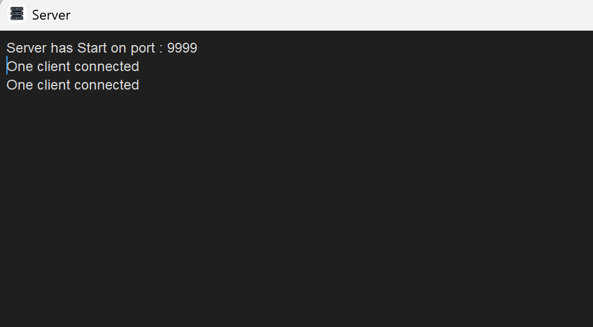
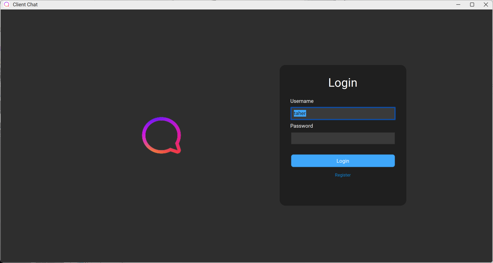
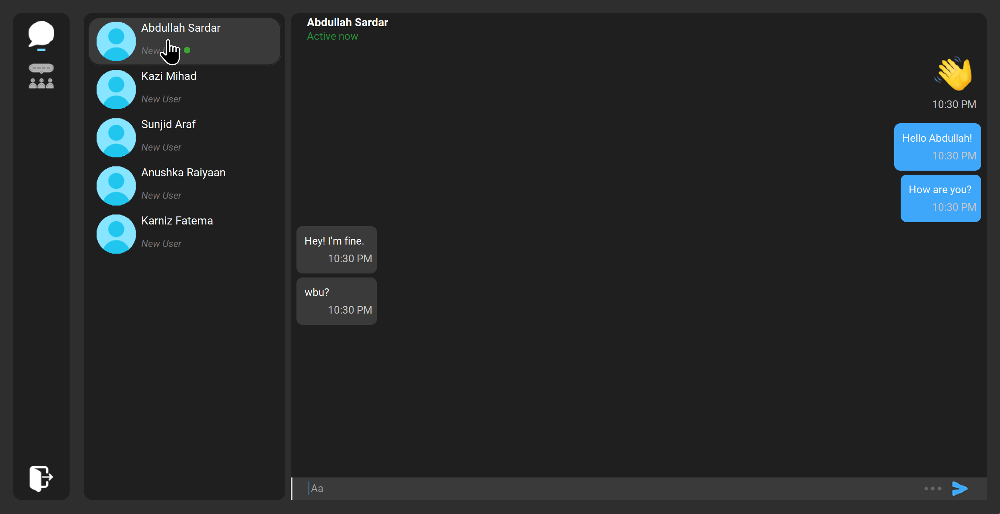
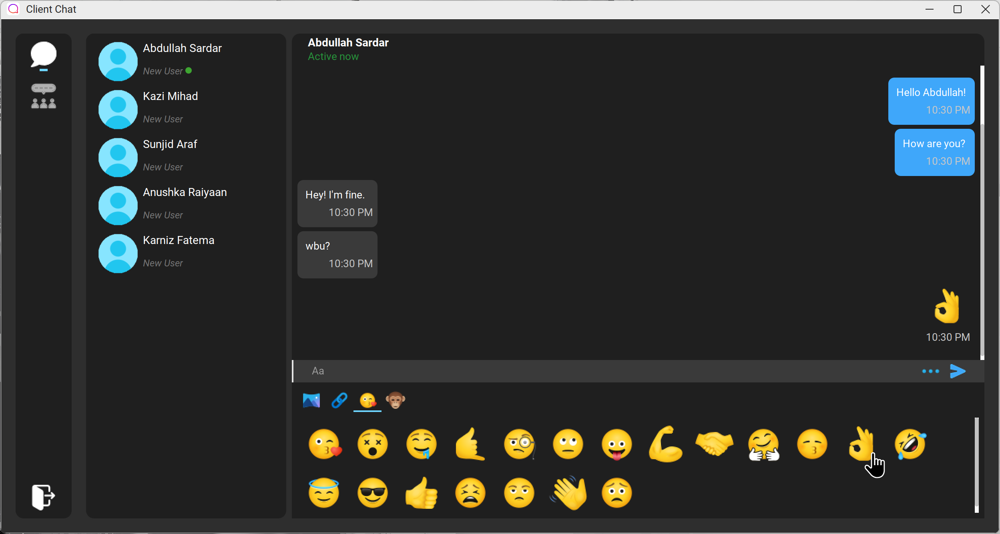

#  Java Chat Application (Client-Server using Sockets)

A multithreaded **client-server chat application** built with **Java Socket Programming**.  
This project demonstrates **real-time communication** where multiple clients can connect to a central server and exchange messages concurrently.

---

## 📋 Table of Contents

- [ Java Chat Application (Client-Server using Sockets)](#-java-chat-application-client-server-using-sockets)
  - [📋 Table of Contents](#-table-of-contents)
  - [🎯 Overview](#-overview)
  - [✨ Features](#-features)
  - [🏗️ System Architecture](#️-system-architecture)
  - [🔧 Prerequisites](#-prerequisites)
  - [🚀 Getting Started](#-getting-started)
  - [📁 Project Structure](#-project-structure)
  - [📸 Screenshots](#-screenshots)
    - [🖥️ Server Console](#️-server-console)
    - [🔑 Client Login](#-client-login)
    - [💬 Chat Interface](#-chat-interface)
  - [👥 Contributors](#-contributors)
  - [🙏 Acknowledgments](#-acknowledgments)

## 🎯 Overview

- **Language:** Java (JDK 1.8+)
- **Concepts:** Socket Programming, Multithreading, I/O Streams
- **GUI:** Swing / AWT
- **Architecture:** Client-Server with multiple client handlers

## ✨ Features

- **Multi-client Support:** Handle multiple clients simultaneously
- **Real-time Messaging:** Instant message broadcasting to all connected clients
- **GUI Interface:** User-friendly graphical interface for both server and client
- **Multithreaded Architecture:** Each client connection handled in separate threads
- **Cross-platform Compatibility:** Works on Windows and Linux

## 🏗️ System Architecture

```
                    Server
                      |
    ┌─────────────────┼─────────────────┐
    │                 │                 │
ClientHandler     ClientHandler     ClientHandler
Thread 1          Thread 2          Thread 3
    │                 │                 │
  Client1           Client2           Client3
```

The server accepts multiple client connections and creates a dedicated `ClientHandler` thread for each client to manage message broadcasting.

## 🔧 Prerequisites

- **Java SE 8+** or later
- **Java IDE** (NetBeans, IntelliJ IDEA, or Eclipse) - optional but recommended
- **JDK** installed and configured
- **MySQL** installed and database created from `sql-queries.sql`

---

## 🚀 Getting Started

1. **Clone the repository:**

   ```bash
   git clone https://github.com/taher-dev/Chat-Application-JAVA.git

   cd java-chat-application
   ```

2. **Open the project** in your preferred Java IDE.
3. **Compile** the source code.
4. **Run the Server:** Execute the `Main.java` file first.

   File Location:
   `server\src\main\Main.java`

   The console will indicate that the server has started on port 9999.

5. **Run the Client(s):** Execute the `Main.java` file.

   File Location:
   `server\src\main\Main.java`

   You can run multiple instances of the client to simulate a group chat.

---

## 📁 Project Structure

```
Chat-Application-JAVA/
├───Chat_Application
│   └───src
│       ├───app
│       ├───component
│       ├───emoji
│       │   └───icon
│       ├───event
│       ├───form
│       ├───images
│       ├───main
│       ├───model
│       ├───service
│       ├───swing
│       │   └───blurHash
│       └───themes
└───server
    └───src
        ├───app
        ├───connection
        ├───main
        ├───model
        ├───service
        └───swing
            └───blurHash
```

## 📸 Screenshots

Here’s what the application looks like in action:

---

### 🖥️ Server Console

Shows client connection notifications.



---

### 🔑 Client Login

The initial login screen for the client application.



---

### 💬 Chat Interface

The main chat window where messages are exchanged between clients.

| Chat View 1                                          | Chat View 2                                           |
| ---------------------------------------------------- | ----------------------------------------------------- |
|  |  |

---

## 👥 Contributors

| Avatar                                                                                                                | Name                                                    | Email                         |
| --------------------------------------------------------------------------------------------------------------------- | ------------------------------------------------------- | ----------------------------- |
| [](https://github.com/taher-dev) | **[Taher Mahmud Monmoy](https://github.com/taher-dev)** | monmoyzx@gmail.com            |
| [](https://github.com/aaarafat17)   | **[Abdullah Sardar](https://github.com/aaarafat17)**    | abdullahalarafat147@gmail.com |

---

## 🙏 Acknowledgments

- This project was developed as part of the **Computer Networking Lab (CSE 312)** course at **Green University of Bangladesh**.
- A special thanks to our course teacher, **Rusmita Halim Chaity**, for her guidance.

**Note:** This project is for educational purposes and demonstrates fundamental concepts of socket programming and multithreading in Java.
